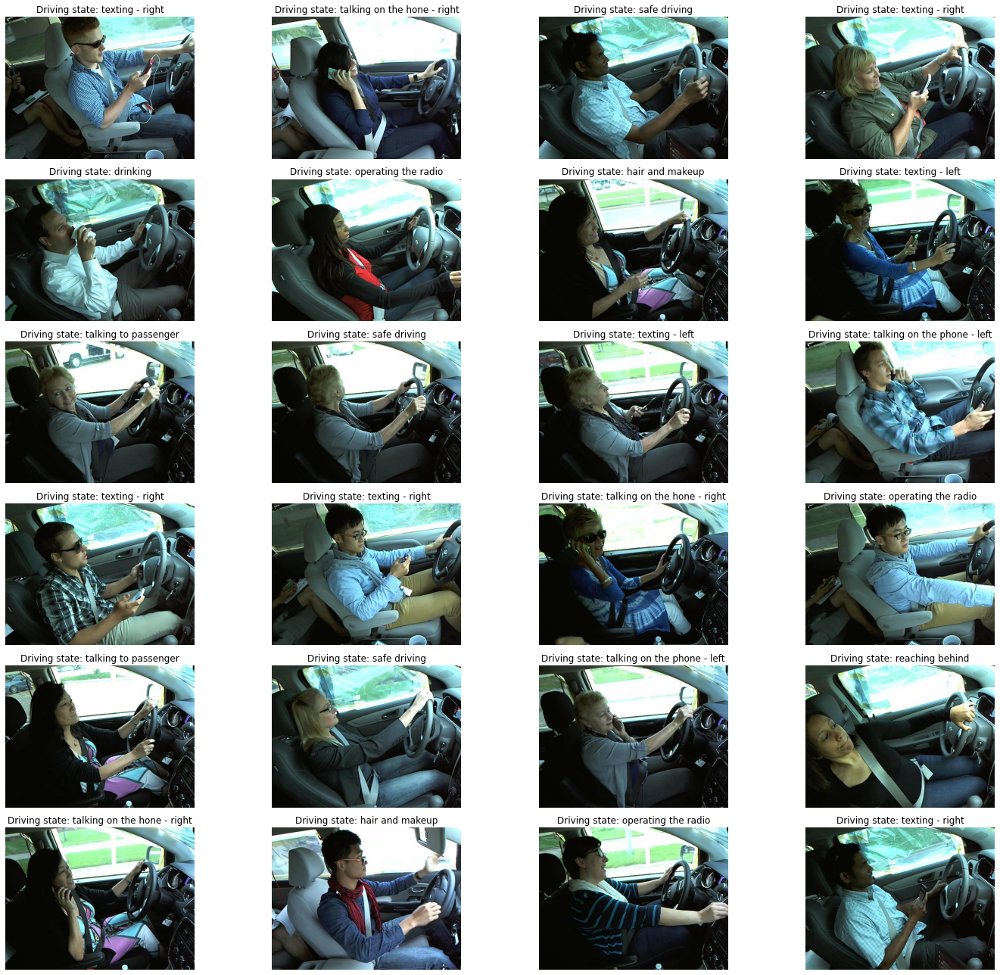
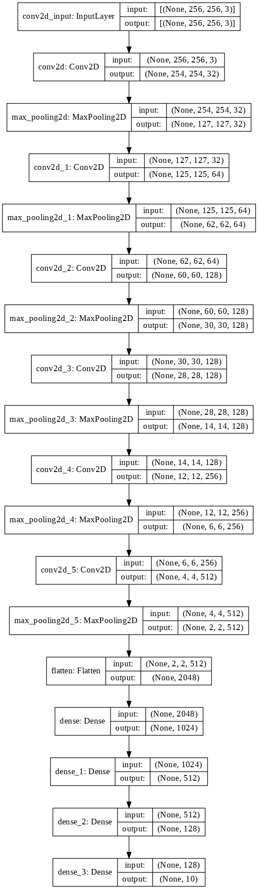
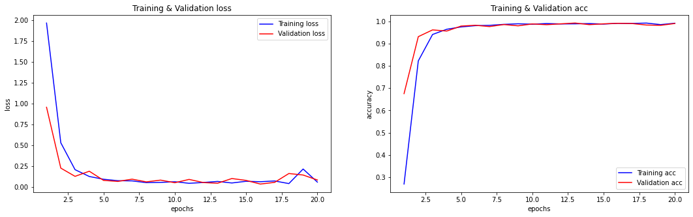
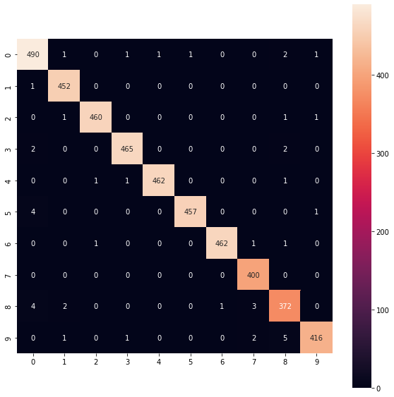

# State Farm Distracted Driver Detection
### Can computer vision spot distracted drivers?
---

## Background:
1. Nearly 4,000 people were killed in crashes involving distracted drivers in 2015. Distracted driving was the reported cause of death of 3,450 people in 2016. An estimated 391,000 drivers were injured in distracted driving crashes in 2017 (Motor Vehicle Crash report for 2019)
2. Available camera that could realtime monitoring the driver from distracted

## Methods:

### Approach:
We are going to use CNN to predict different type of distacted diver images. The model will have training and validation processes. 

### Data sources:
Dataset is available from  https://www.kaggle.com/c/state-farm-distracted-driver-detection

Image 1: 

## Results:

Image 2: 

We  used 20 epochs and early stopping monitoring on validation loss and model check point saving the model weights. 

Data augmentation on the datasets was also implmented but it did not help the prediction.

Overfitting seems small form the figure Image 3.

Image 3: 

Confusion matrix were provided to evaluate the model preformance
Image 4: 

Image 5: 

Image 6: 

It is interesting that darker skin give a wrong prediction in this excerise, but overall precition was very good.

## Conclusion:
Distracted drivers can be spotted by CNN model. The model prediction was pretty good in Training (0.991) as well as validation (0.990)

### Future imporvement
This ML model can be implemented in real-time simulation where as the camere is placed in the car. 
